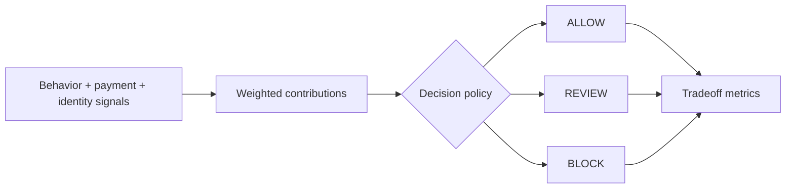

# Risk Decision System

**DECIDE · Risk & policy**

### Product question
**How do you contain risk earlier without turning protection into unnecessary customer harm?**

**[▶ Try the Risk Decision System live](https://ash-intelligence-lab.streamlit.app/?product=fraud-signal-decision-engine)** · **[Explore the full systems lab](https://ash-intelligence-lab.streamlit.app/)**

`Python · risk decisioning · policy tradeoffs · human review`

Risk Decision System is the **DECIDE** flagship in Ash Intelligence. It combines behavioral, payment and identity signals into explainable **ALLOW / REVIEW / BLOCK** states while keeping policy thresholds separate from signal scoring.

The goal is not to maximize blocking. A risk system can reduce fraud and still be a poor product if false positives hurt good users or too much traffic is pushed into manual review.

## What the code models

`DecisionPolicy` keeps review and block thresholds separate from signal weights, so policy can change without rewriting scoring logic.

`decide(...)` returns the score, action, top reason codes, per-signal contributions and the thresholds that produced the decision.

`batch_metrics(...)` runs labeled synthetic cases and exposes four product-level tradeoffs:

- block rate
- review rate
- fraud containment rate
- good-user block rate

That keeps customer harm and operational load visible alongside containment.

## Decision flow



## Product principle

**A consequential decision should expose the evidence, policy and customer cost behind the action—not only the score.**

This prototype keeps signal scoring, policy thresholds and human review as separate, inspectable product boundaries.

## Run

```bash
python main.py
python main.py --test
python -m unittest discover -s tests -v
```

No external services or API keys are required. The cases are synthetic and the project is a decision/policy prototype rather than a trained fraud model.

## Next

The next iteration is threshold calibration against a versioned labeled dataset, review-capacity modeling, cohort-level false-positive analysis and expected-loss-versus-conversion tradeoffs.

Part of **DECIDE** in the broader [Ash Intelligence Lab](https://github.com/AshIntelligence/agenticmine).
