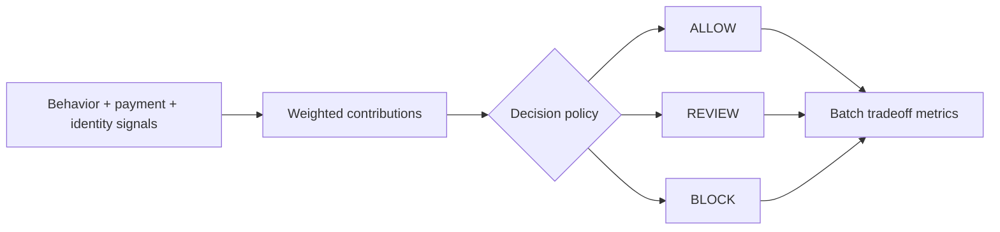

# Risk Decision System

**DECIDE flagship in the [Ash Intelligence Lab](https://github.com/AshIntelligence/agenticmine)**

**[▶ Try the Risk Decision System live](https://ash-intelligence-lab.streamlit.app/?product=fraud-signal-decision-engine)** · **[Open the full lab](https://ash-intelligence-lab.streamlit.app/)**

`Python · risk decisioning · policy tradeoffs · human review`

This system combines behavioral, payment and identity signals into explainable **ALLOW / REVIEW / BLOCK** states while keeping policy thresholds separate from signal scoring.

A risk system is only useful if it improves containment without creating unnecessary customer friction. The code therefore tracks both protection and harm: block rate, review rate, fraud containment and good-user block rate.

## Decision logic

`DecisionPolicy` keeps review and block thresholds separate from signal weights, so policy can move without rewriting scoring logic.

`decide(...)` returns the score, action, top reason codes, per-signal contributions and the thresholds that produced the decision.

`batch_metrics(...)` runs labeled synthetic cases and reports:

- block rate
- review rate
- fraud containment rate
- good-user block rate

## Decision flow



## Run

```bash
python main.py
python main.py --test
python -m unittest discover -s tests -v
```

No external services or API keys are required. The cases are synthetic; this is a policy and decisioning prototype, not a trained production fraud model.

## Next

Threshold calibration against a versioned labeled dataset, review-capacity modeling, cohort-level false-positive analysis and expected-loss-versus-conversion tradeoffs.
